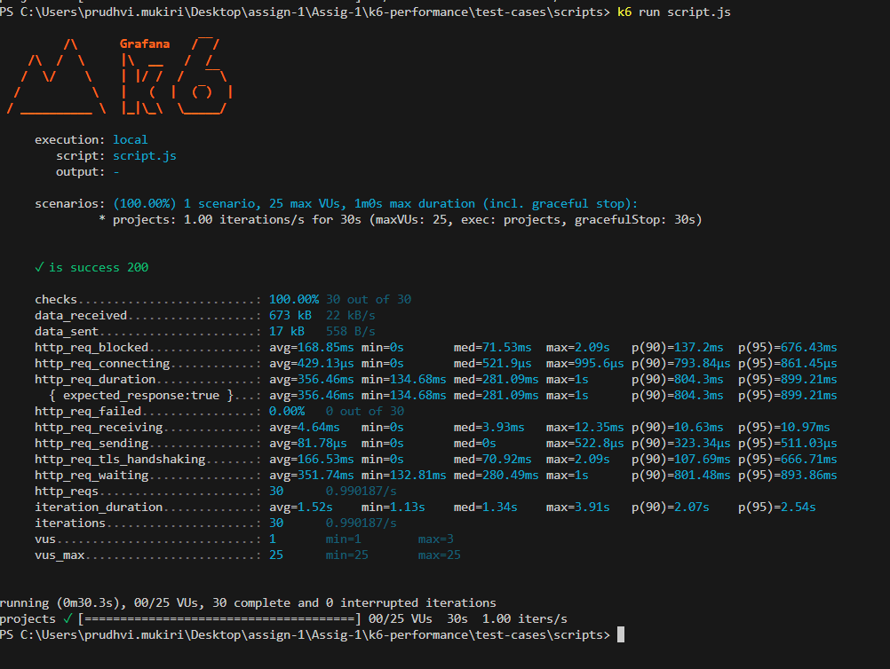
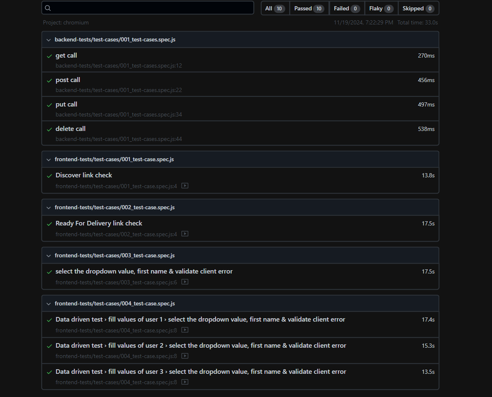

# Polestar QA Tests

## Pre-requisites

### Below applications to be installed

- node.js
- vs code

### Actions Points Covered

1. Added the frontend, backed and k6-performance test cases.
2. Implemented in Page Object Model.
3. Implemented Data Driven Test cases.
4. Handled the parallel execution.
5. configured azure pipeline & gitHub Actions yaml with reports and artifacts publish feature.
6. Documented in Readme.md file.
7. Handled cross browser testing (chromium, firefox were enabled, we can run in any other browsers too as per our business requirement).
8. Reports generation along with recording video feature.

## Frontend Tests

This project consists on the frontend test cases on the link https://www.polestar.com/se

- Validated the testcases to test the discover and ready for delivery links check.
- Validated the subcription of news process for Polestar.

### Command to run the frontend test

```
cd frontend-tests

npx playwright test
```

## Backend Test

This project consists on the backend test cases on the link https://reqres.in/

- Implemented the test cases with GET, POST, PUT and DELETE http methods.
- Implemented the request specifications in RequestSpec.js file in utils.

### Command to run the backend test

```
cd backend-tests

npx playwright test
```

## k6-performance Test

This project consists on the k6 performance test case on the link https://www.polestar.com/se/test-drive/booking/ps4/

- Implemented the GET call performance test case with virtual users of 25vu.

### Running k6 test

- We need to install k6 in our windows using below command

```
winget install k6 
```
or manual installation from this repo: https://github.com/grafana/k6/releases

- go to the path k6-performance/test-cases/scripts
- run the below commans ro run script.js for windows run

```
k6 run script.js
```
- you will see the report like this below screenshot 

## Azure pipeline set-up

- I have configured the pipeline stages in such a way that the playwright test can run in the azure pipeline and the json report & artifacts will be published as well. We can find it in azure-pipeline.yml file

## GitHub Actions

- I have integrated the github action pipeline also. pipeline-triggr.yml is provided under './github/workflows' path. I have published the artifactes and reports in pipleline.
  


## Playwright Reports

- Playwright in-built will create the reports with screenshot and video attached an we can view it in this path 'playwright-report'
- We need to open 'index.html' with any of the browser. It will be shown as below picture:



### Tech stack used

- Node.js
- Playwright
- JavaScript
- k6
- yaml 


